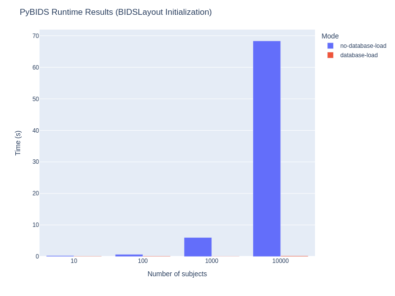
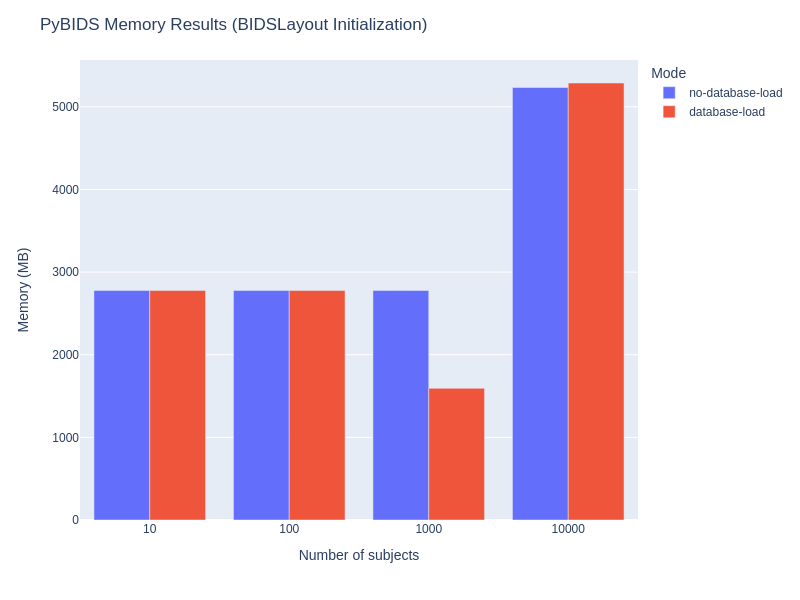
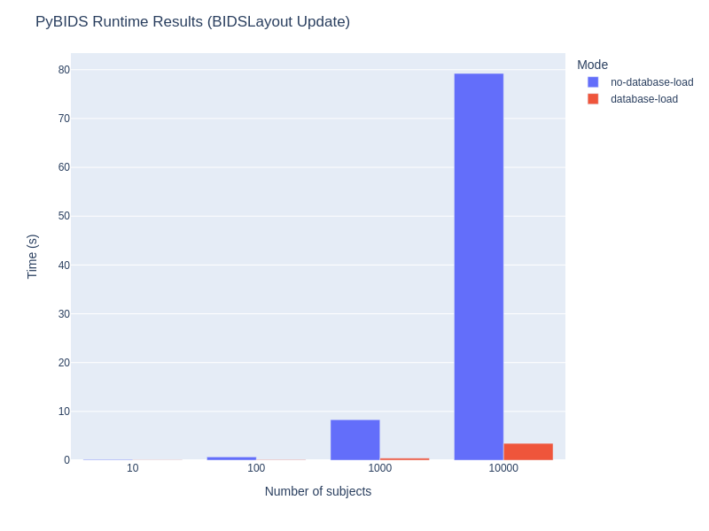
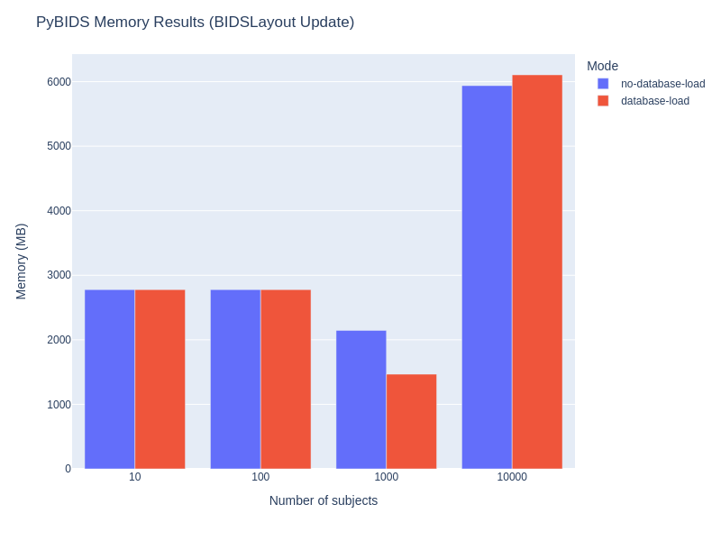

# Generate dummy BIDS datasets for performance evaluation of PyBIDS

This project has been developed to generate dummy BIDS datasets for testing PyBIDS performance on large datasets.

In particular, it contains a dummy BIDS dataset with one subject and python scripts to:
- `code/produce_dummy_bids_datasets.py`: generate dummy BIDS datasets with a varying number of subject
- `code/evaluate_pybids.py`: evaluate pybids on these datasets
- `code/plot_results.py`: plot the results and save the runtime and memory plots in HTML files

The dummy nifti image used in this repository is the result of a dicom to nifti conversion with `dcm2niix` of the dummy dicom series provided by https://github.com/TranslationalML/PACSMAN_data, and distributed under the [Creative Commons Attribution 4.0 International Public License](https://github.com/TranslationalML/PACSMAN_data/blob/main/pacsman_data/data/LICENSE).

## Dependencies

The project requires Python `>=3.10` and depends on the following Python packages:

- `pybids==0.16.4` 
- `pandas`
- `tqdm`
- `argparse`
- `memory_profiler`
- `plotly`
- `kaleido`

A `requirements.txt` file is provided for convenience to install them, which consists of running in a terminal:

```bash
pip install -r requirements.txt
```

## Results

### Description

- **Machine**: Ubuntu 22.04, 32 CPUs, 64GB
- **Test set**: 4 dummy BIDS datasets with 10, 100, 1000, and 10000 subjects respectively
- **Contexts**: "BIDSLayout initialization", "BIDSLayout update"
- **Modes**: "no-database-load", "database-load"
- **PyBIDS version**: 0.16.4

| | Runtime | Memory |
|---|---|---|
| BIDSLayout initialization |  |  |
| BIDSLayout update |  |  |

#### Notes

In this project, we patched the vanilla implementation of the `BIDSLayoutIndexer` with a 
new method (`index_dir`) which indexes only a specific directory and its sub-directories. 

https://github.com/TranslationalML/pybids_performance_eval/blob/83192c69b6fe4743ff2e4a45700d474de41e448e/code/evaluate_pybids.py#L146-L181

Indeed, PyBIDS does not provide any public method to update a BIDSLayout object
  (Referred as *incremental indexing* - See [PyBIDS issue](https://github.com/bids-standard/pybids/issues/522)).
If new files are added to the BIDS dataset, a new BIDSLayout has to be created which
  reindex the whole content, even though a database file is employed.

## How to reproduce

### How to run the whole workflow

For convenience, we are providing the script `run_eval_workflow.sh` which will take care of running all the scripts described below.
With this script, you only have to run in a terminal the following command:

```bash
sh run_eval_workflow.sh
```

This will generate the TSV results file and all the figures in the root directory of the project.

Note that you would need to have Python `>=3.10` with all the dependencies installed (See [List of dependencies](#dependencies)).

### How to generate the dummy BIDS datasets

This is achieved by using the script `code/produce_dummy_bids_datasets.py`.

#### Usage

```output
usage: produce_dummy_bids_datasets.py [-h] [--template_bids_dir TEMPLATE_BIDS_DIR]
                                     [--n_subjects N_SUBJECTS [N_SUBJECTS ...]] [--output_dir OUTPUT_DIR]

Produce dummy BIDS dataset(s) for testing.

options:
    -h, --help            show this help message and exit
    --template_bids_dir TEMPLATE_BIDS_DIR
                        Path to template BIDS dataset. If not specified, the template BIDS dataset will be the
                        root directory.
    --n_subjects N_SUBJECTS [N_SUBJECTS ...]
                        List of number of subjects to produce. Each item in the list will produce a dataset with
                        that number of subjects.
    --output_dir OUTPUT_DIR
                        Path to output directory. If not specified, the output directory will be derivatives/ of
                        the root directory.                     
```

#### Example

If you wish to generate 4 dummy datasets in the `derivatives/` folder with a number of 10, 100, 1000, and 10000 subjects, this would correspond to the following command:

```bash
python /path/to/produce_dummy_bids_datasets.py --n_subjects 10 100 1000 10000
```

### How to run the performance evaluation

This is achieved by using the script `code/evaluate_pybids.py`.

#### Usage

```output
usage: evaluate_pybids.py [-h] [--n_subjects N_SUBJECTS [N_SUBJECTS ...]] [--datasets_root DATASETS_ROOT]
                          [-o OUTPUT_TSV]

Evaluate the performance of PyBIDS on dummy BIDS datasets generated by `produce_dummy_bids_datasets.py`.

options:
    -h, --help            show this help message and exit
    --n_subjects N_SUBJECTS [N_SUBJECTS ...]
                            Number of subjects to include in the dataset
    --datasets_root DATASETS_ROOT
                            Path to the root directory containing the datasets, generated by the
                            `produce_dummy_bids_datasets.py` script. Note that the dataset directories are expected to be
                            named dummy-<n_subjects> where <n_subjects> is the number of subjects. Default: derivatives/ in
                            the root directory.
    -o OUTPUT_TSV, --output_tsv OUTPUT_TSV
                            Path to output TSV file. If not specified, the results will be printed to stdout.
```

#### Example

For instance, if you wish to evaluate pybids on the 4 dummy datasets previously created in the `derivatives/` folder, you would run the following command:

```bash
python /path/to/evaluate_pybids.py \
    --n_subjects 10 100 1000 10000 \
    --output_tsv '/path/to/profiling_results.tsv'
```

### How to generate the plots

This is achieved by using the script `code/plot_results.py`.

#### Usage

```output
usage: plot_results.py [-h] --input_tsv INPUT_TSV

Plot the results of the PyBIDS evaluation and save them as HTML and PNG files. The output HTML files will be saved with
the same prefix as the input TSV file, but with a suffix and extension added to the end. For example, if the input TSV
file is named `profiling_results.tsv`, then the output HTML/PNG files will be named `profiling_results_time.html/png`
and `profiling_results_memory.html/png`.

options:
    -h, --help            show this help message and exit
    --input_tsv INPUT_TSV
                            Path to input TSV file. If not specified, the results will be read from stdin.
```

#### Example

For instance, if you wish to create the plots from the evaluation previously run, you would run the following command:

```bash
python /path/to/plot_results.py \
    --input_tsv '/path/to/profiling_results.tsv'
```
